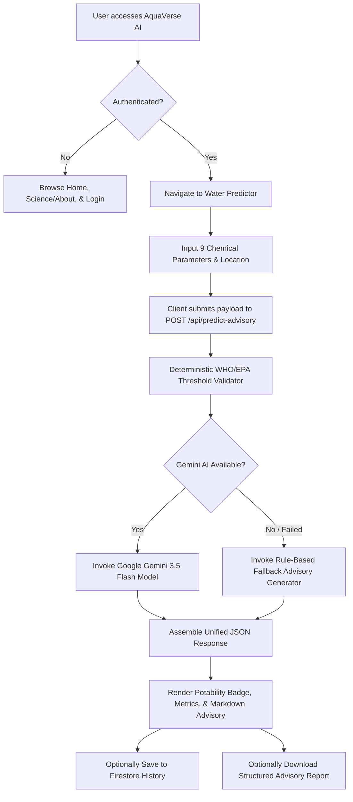
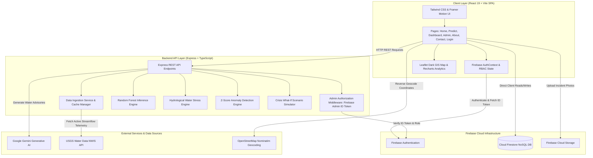

# AquaVerse AI

> **AI-powered water quality intelligence for safer, data-driven water assessment.**

AquaVerse AI is an open-source, full-stack water quality assessment and hydrological intelligence platform engineered to bridge the gap between complex environmental telemetry and actionable public health safety. The platform pairs deterministic World Health Organization (WHO) and US Environmental Protection Agency (EPA) chemical standards with Google Gemini generative AI advisory reports, Scikit-Learn Random Forest streamflow forecasting, statistical Z-score anomaly detection, and live public telemetry ingestion from the United States Geological Survey (USGS). Built with a modern React 19 frontend and a hardened Express/Node.js backend, AquaVerse AI empowers citizens to evaluate water potability, enables municipal supervisors to forecast watershed stress across multi-day horizons, and provides community incident reporting with end-to-end role-based security.

---

## Table of Contents

- [Overview](#overview)
- [Key Features](#key-features)
  - [1. Water Quality & Potability Analysis](#1-water-quality--potability-analysis)
  - [2. AI-Powered Advisory Engine](#2-ai-powered-advisory-engine)
  - [3. Hydrologic Streamflow & Demand Forecasting (Machine Learning)](#3-hydrologic-streamflow--demand-forecasting-machine-learning)
  - [4. Hydrological Water Stress Risk Model](#4-hydrological-water-stress-risk-model)
  - [5. Telemetry Anomaly Detection Engine](#5-telemetry-anomaly-detection-engine)
  - [6. Crisis What-If Scenario Simulator](#6-crisis-what-if-scenario-simulator)
  - [7. Telemetry & Analytics Dashboard](#7-telemetry--analytics-dashboard)
  - [8. Citizen Incident Reporting & Support](#8-citizen-incident-reporting--support)
  - [9. Supervisor Administration Hub](#9-supervisor-administration-hub)
- [How It Works](#how-it-works)
  - [User & Analysis Workflow](#user--analysis-workflow)
  - [Machine Learning Forecasting Workflow](#machine-learning-forecasting-workflow)
- [System Architecture](#system-architecture)
  - [Architectural Layers](#architectural-layers)
- [Technology Stack](#technology-stack)
- [Project Structure](#project-structure)
- [Data Ingestion & Provenance](#data-ingestion--provenance)
  - [USGS Real-Time Ingestion](#usgs-real-time-ingestion)
  - [Demonstration Watershed Disclosures](#demonstration-watershed-disclosures)
- [Machine Learning Pipeline Details](#machine-learning-pipeline-details)
- [Firebase & Database Integration](#firebase--database-integration)
  - [Firestore Collections](#firestore-collections)
  - [Security Rules & Data Invariants](#security-rules--data-invariants)
- [Security Considerations & RBAC](#security-considerations--rbac)
- [Installation & Setup](#installation--setup)
  - [Prerequisites](#prerequisites)
  - [Clone & Install Dependencies](#clone--install-dependencies)
  - [Environment Configuration](#environment-configuration)
- [Running Locally](#running-locally)
- [Building for Production](#building-for-production)
- [Deployment](#deployment)
- [Future Improvements](#future-improvements)
- [Contributors & Contact](#contributors--contact)
- [Research & References](#research--references)
- [License](#license)

---

## Overview

### The Problem
Access to safe, clean drinking water is one of the most pressing global challenges. Over 2 billion people worldwide drink from contaminated water sources, contributing to preventable waterborne illnesses such as cholera, dysentery, and heavy metal poisoning. In many regions, water quality testing remains inaccessible, slow, or difficult for non-specialists to interpret. Furthermore, municipal water managers lack unified, lightweight tools to monitor watershed stress, predict streamflow depletion, and address citizen-reported contamination events in real time.

### Why Water Quality Monitoring Matters
Contaminants such as excess nitrates, heavy metals, industrial solvents, and disinfection byproducts (such as Trihalomethanes) are often invisible, tasteless, and odorless. Continuous physical monitoring combined with automated compliance verification against verified health guidelines is critical to preventing public health crises and preserving watershed ecology.

### What AquaVerse AI Provides
1. **Immediate Potability Verdicts**: Instant rule-based verification of 9 core chemical parameters against WHO/EPA drinking water standards.
2. **Contextual AI Advisories**: Natural language explanations generated by Google Gemini, outlining specific health risks, pathogen vulnerabilities, and step-by-step filtration methods (e.g., Reverse Osmosis, sediment pre-filters, UV sanitization).
3. **Hydrological Forecasting**: Multi-day streamflow and water demand projections powered by a trained Scikit-Learn Random Forest Regressor.
4. **Early Warning & Crisis Simulation**: Quantitative water stress risk probabilities (7d, 14d, 30d horizons) and what-if crisis modeling for reservoir depletion and demand surges.
5. **Community Engagement**: Geocoded citizen incident reporting with photo upload capabilities and tracking.

### Intended Users
- **Citizens & Consumers**: Test domestic well water or municipal tap samples, understand health implications, and download advisory reports.
- **Municipal Engineers & Water Authorities**: Monitor station telemetry, evaluate watershed supply vs. demand balance, and analyze historical holdout model metrics.
- **Environmental Researchers & Students**: Study hydrological time series data, explore machine learning feature importances, and evaluate water quality parameters.

---

## Key Features

### 1. Water Quality & Potability Analysis
- **9 Monitored Chemical Parameters**:
  - **pH** ($6.5 - 8.5$ normal range)
  - **Turbidity** ($< 1.0\text{ NTU}$ target, $< 5.0\text{ NTU}$ maximum limit)
  - **Total Dissolved Solids (TDS)** ($< 500\text{ ppm}$ optimal, $< 1000\text{ ppm}$ acceptable)
  - **Chloramines** ($< 4.0\text{ ppm}$ EPA Maximum Residual Disinfectant Level)
  - **Sulfate** ($< 250\text{ mg/L}$ Secondary Maximum Contaminant Level)
  - **Trihalomethanes (THMs)** ($< 80\text{ ppb}$ EPA Maximum Contaminant Level)
  - **Conductivity** ($< 1000\text{ }\mu\text{S/cm}$)
  - **Total Organic Carbon (TOC)** ($< 4.0\text{ ppm}$)
  - **Total Hardness** ($75 - 150\text{ mg/L CaCO}_3$)
- **Deterministic Compliance Checking**: Real-time validation checking each parameter individually and computing an overall compliance confidence score ($0 - 100\%$).
- **Safety Verdict**: Binary classification (`safe` | `unsafe`) based on whether at least 5 of 6 primary health-critical parameters pass WHO/EPA guidelines.
- **Sample Presets**: Quick-load preset values for testing: *Potable Tap Water*, *Wild Natural Stream*, and *Contaminated Industrial Runoff*.
- **Geolocation Tagging**: Auto-captures browser GPS coordinates or allows manual watershed station naming.

### 2. AI-Powered Advisory Engine
- **LLM Provider**: `@google/genai` integrating **Google Gemini 3.5 Flash** (with automatic fallback to `gemini-3.1-flash-lite`).
- **Input Context**: Ingests the 9 chemical parameter values, geographic location label, deterministic compliance pass/fail checklist, and detected contaminant flags.
- **Generated Output**: Formats a structured Markdown report comprising:
  1. *Water Safety Verdict*
  2. *Specific Parameter Concerns*
  3. *Purification & Treatment Recommendations* (e.g., neutralizing filters, Reverse Osmosis, activated carbon)
  4. *General Health Advisory*
- **Offline / Graceful Fallback**: If the Gemini API key is not configured or network requests fail, the server automatically invokes a local, rule-based advisory generator (`generateFallbackAdvisory`) to guarantee uninterrupted operational availability.

### 3. Hydrologic Streamflow & Demand Forecasting (Machine Learning)
- **Algorithm**: `RandomForestRegressor` from `scikit-learn` (`n_estimators=100`, `max_depth=8`, `min_samples_split=4`, `min_samples_leaf=2`).
- **Dataset**: Trained on 349 valid daily streamflow/discharge observations ($00060$ in $\text{ft}^3/\text{s}$ / $\text{cfs}$) from USGS Station `09058000` (*Colorado River near Kremmling, CO*).
- **Multi-Step Recursive Horizon**: Generates multi-step recursive forecasts for **7-day**, **14-day**, and **30-day** periods.
- **Evaluation**: Evaluated on an untouched $15\%$ chronological holdout test set ($53$ daily samples):
  - **Mean Absolute Error (MAE)**: `55.46` (vs. Baseline `76.07` $\rightarrow$ **$27.10\%$ reduction in error**).
  - **Root Mean Squared Error (RMSE)**: `76.31` (vs. Baseline `104.13`).
  - **Mean Absolute Percentage Error (MAPE)**: `6.04%` (vs. Baseline `8.55%`).
- **Dominant Feature**: `demand_lag_1` ($94.45\%$ Gini feature importance), capturing temporal streamflow momentum.

### 4. Hydrological Water Stress Risk Model
- **Deterministic Logit Formulation**: Evaluates reservoir and basin vulnerability based on four normalized physical drivers:
  $$\text{Storage Depletion } S = \frac{100 - \text{StorageLevelPct}}{100}$$
  $$\text{Deficit Ratio } D = \max\left(0, \frac{\text{ProjectedDemand} - \text{InflowSupply}}{\text{ProjectedDemand}}\right)$$
  $$\text{Rainfall Deficit } R = \frac{\text{RainfallDeficitPct}}{100}$$
  $$\text{Water Quality Loss } Q = \max\left(0, \frac{80 - \text{WQI}}{100}\right)$$
- **Logistic Risk Scoring**: Calculates risk probability ($0 - 100\%$) across scalable horizon factors ($7\text{d} = 0.82$, $14\text{d} = 0.91$, $30\text{d} = 1.0$).
- **Risk Categorization**:
  - `LOW` ($0\% - 29\%$)
  - `MODERATE` ($30\% - 59\%$)
  - `HIGH` ($60\% - 79\%$)
  - `CRITICAL` ($80\% - 100\%$)

### 5. Telemetry Anomaly Detection Engine
- **Statistical Z-Score & 3-Sigma Bounds**: Computes deviation scores for incoming station telemetry against established historical baselines:
  $$Z = \frac{|\text{Observed} - \mu|}{\sigma}$$
- **Severity Rating**: Classifies anomalies as `MEDIUM` ($Z \ge 2.0$), `HIGH` ($Z \ge 2.7$), or `CRITICAL` ($Z \ge 3.2$).
- **Monitored Variables**: pH, Turbidity, and Total Dissolved Solids (TDS).

### 6. Crisis What-If Scenario Simulator
- **Interactive Stress Testing**: In-memory scenario simulator allowing operators to adjust:
  - Reservoir Storage Level ($5\% - 95\%$)
  - Demand Surge Percentage ($-30\% \text{ to } +50\%$)
  - Rainfall Deficit Percentage ($0\% - 90\%$)
- **Instant Risk Delta Calculation**: Computes baseline vs. simulated risk probabilities and reports net percentage point shifts ($\Delta$) without modifying database records.

### 7. Telemetry & Analytics Dashboard
- **Telemetry Visualizers**: Recharts area and line charts tracking Water Quality Index (WQI), Turbidity, and Streamflow discharge.
- **USGS Station Switcher**: Select between live USGS river monitoring stations and demonstration regional watershed nodes.
- **Data Provenance Badging**: Clear indicators displaying telemetry freshness (`LIVE`, `RECENT`, `STALE`, `UNAVAILABLE`) and USGS source identifiers.

### 8. Citizen Incident Reporting & Support
- **Community Incident Submissions**: Citizens submit water contamination reports with title, description, category, and photo evidence.
- **Reverse Geocoding**: Integrated OpenStreetMap Nominatim API for automatic street/neighborhood reverse geocoding from GPS coordinates.
- **Status Lifecycle**: Reports move through `Pending` $\rightarrow$ `Under Investigation` $\rightarrow$ `Resolved` / `Rejected`.
- **Downloadable Advisory Reports**: One-click download of generated water safety advisories as structured `.txt` files.

### 9. Supervisor Administration Hub
- **Interactive GIS Map (Leaflet)**: Dark-themed map displaying USGS stations (cyan badges), citizen incident reports (status-colored pins), and geographic risk zones.
- **Holdout Model Evaluation Visualizer**: Interactive line chart on `/admin` plotting **Actual USGS Streamflow vs. Random Forest Predictions** strictly on the 53-sample holdout test set.
- **Community Reports & Inquiries Manager**: Filter, investigate, resolve, or delete community reports and contact submissions.
- **User Directory**: View registered user profiles, creation dates, and roles.
- **Activity Audit Logs**: Immutable chronological record of system predictions and citizen report submissions.

---

## How It Works

### User & Analysis Workflow



### Machine Learning Forecasting Workflow

```mermaid
flowchart LR
    A[USGS NWIS Site 09058000 Streamflow Data] --> B[Feature Engineering: Lags & Rolling Stats]
    B --> C[Strict Chronological Split: 70% Train / 15% Val / 15% Test]
    C --> D[Scikit-Learn RandomForestRegressor Training]
    D --> E[Export joblib Model & model_metadata.json]
    
    E --> F[Express Backend Inference Engine]
    F --> G[Recursive Multi-Step Forecasting: 7d, 14d, 30d]
    G --> H[Hydrological Water Stress Logit Engine]
    H --> I[Admin Model Evaluation Dashboard & Holdout Test Charts]
```



---

## System Architecture



### Architectural Layers

1. **Presentation Layer (Frontend)**:
   - Built with **React 19**, **TypeScript**, and bundled via **Vite**.
   - Styled using **Tailwind CSS v4** with a custom dark water aesthetic palette (`#000000`, `#06111C`, `#08243A`, `#168CFF`, `#42D9FF`).
   - Micro-animations powered by **Framer Motion** (`motion/react`).
   - Visualizations using **Recharts** (area, bar, line, and donut charts) and **Leaflet** (interactive GIS station/incident mapping).
2. **Application & API Layer (Backend)**:
   - **Express.js** service running unified in development mode through Vite middleware and compiled via `esbuild` for production.
   - Authoritative security middleware (`requireAdminAuth`) validating Firebase ID tokens using the `firebase-admin` SDK.
3. **Analytical & Machine Learning Layer**:
   - Python/Scikit-Learn trained `RandomForestRegressor` with serialized metadata in `model_metadata.json`.
   - Deterministic hydrological risk logit calculator and statistical Z-score anomaly analyzer.
4. **Data & Persistence Layer**:
   - **Cloud Firestore** for user profiles, analysis logs, citizen reports, and immutable audit logs.
   - **Firebase Storage** for community report photographic attachments.
   - **In-Memory Cache Service** (`serverCache`) providing a 5-minute TTL to prevent rate-limiting when querying external USGS APIs.

---

## Technology Stack

| Category | Technology | Purpose |
| :--- | :--- | :--- |
| **Frontend Framework** | React 19 (`react`, `react-dom`) | Declarative UI rendering & state management |
| **Language** | TypeScript (~5.8) | Full-stack end-to-end type safety |
| **Build & Dev Tooling** | Vite 6, `tsx`, `esbuild` | Fast HMR dev server & production bundling |
| **Styling & Design** | Tailwind CSS v4, `@tailwindcss/vite` | Modern utility-first dark responsive design |
| **Animations** | Motion (`motion/react` v12) | Smooth layout transitions & UI micro-interactions |
| **Icons** | Lucide React | Clean, modern vector icons |
| **Data Visualization** | Recharts (v3.9) | Interactive telemetry, forecasting, and evaluation charts |
| **GIS Mapping** | Leaflet (v1.9) | Interactive watershed station and incident pin mapping |
| **Backend Framework** | Express 4 (`express`) | REST API routing and server-side middleware |
| **AI Advisory Engine** | `@google/genai` (Gemini 3.5 Flash / 3.1 Flash Lite) | Structured Markdown water safety advisory generation |
| **Machine Learning** | Python, `scikit-learn`, `joblib`, `pandas`, `numpy` | Time-series feature engineering & Random Forest training |
| **Authentication** | Firebase Authentication (v12) | Email/password login, session persistence, password reset |
| **NoSQL Database** | Cloud Firestore | Data persistence for users, predictions, reports, and logs |
| **Object Storage** | Firebase Cloud Storage | Citizen water contamination photo evidence storage |
| **Server Administration**| `firebase-admin` (v14) | Authoritative token verification & server role checks |
| **External Hydrology Data**| USGS Water Data API (NWIS) | Real continuous streamflow & gage height telemetry |
| **Geocoding** | OpenStreetMap Nominatim API | Reverse geocoding of GPS coordinates |

---

## Project Structure

```text
aquaverse-ai/
├── server/                               # Backend services, data providers, & ML models
│   ├── data/
│   │   ├── normalizers/
│   │   │   └── waterDataNormalizer.ts    # USGS telemetry normalizer & WQI index calculation
│   │   ├── providers/
│   │   │   └── usgsProvider.ts           # USGS NWIS API integration client
│   │   ├── cacheService.ts               # In-memory data caching & ingestion logger
│   │   └── dataService.ts                # Station aggregator & data access layer
│   └── ml/
│       ├── demand_rf_model.joblib        # Serialized scikit-learn Random Forest model
│       ├── demandPredictor.ts            # TypeScript ML forecast execution engine
│       ├── model_metadata.json           # Model hyperparameters, metrics, & holdout telemetry
│       ├── predict_demand.py             # Python model inference script
│       ├── streamflow_rf_model.joblib    # Streamflow model artifact
│       └── train_demand_model.py         # Model training script with chronological splitting
│
├── src/                                  # Frontend React application
│   ├── components/
│   │   ├── AdminCharts.tsx               # Recharts breakdown charts for admin hub
│   │   ├── AdminMap.tsx                  # Leaflet dark GIS map component
│   │   ├── Footer.tsx                    # Application footer with links & status
│   │   └── Navbar.tsx                    # Header with navigation & role-based routes
│   ├── firebase/
│   │   ├── AuthContext.tsx               # React Auth provider & user state management
│   │   ├── config.ts                     # Firebase SDK initialization
│   │   └── utils.ts                      # Firestore CRUD helper functions & storage uploads
│   ├── pages/
│   │   ├── About.tsx                     # Water science & chemical parameter encyclopedia
│   │   ├── Admin.tsx                     # Supervisor administration portal & model evaluation
│   │   ├── Contact.tsx                   # Citizen incident reporting & contact inquiries
│   │   ├── Dashboard.tsx                 # Real-time telemetry, forecasting, & simulation
│   │   ├── Home.tsx                      # Landing page with mission, features, & live previews
│   │   ├── Login.tsx                     # Authentication portal (Sign In / Register / Reset)
│   │   └── Predict.tsx                   # Water quality analysis & AI advisory generator
│   ├── services/
│   │   ├── anomalyDetectionEngine.ts     # Statistical Z-Score anomaly engine
│   │   ├── demandForecastEngine.ts       # Hydrological forecasting client service
│   │   ├── modelEvaluationEngine.ts      # Admin model evaluation telemetry fetcher
│   │   ├── simulationEngine.ts           # Crisis what-if scenario simulator
│   │   └── waterStressEngine.ts          # Hydrological logit water stress risk engine
│   ├── App.tsx                           # Main router & protected route wrappers
│   ├── index.css                         # Tailwind CSS imports & custom styling tokens
│   ├── main.tsx                          # React DOM entry point
│   └── types.ts                          # Comprehensive TypeScript interfaces & type definitions
│
├── .env.example                          # Template for environment configuration
├── ARCHITECTURE.md                       # Architectural documentation & data pipeline flows
├── DATA_ARCHITECTURE.md                  # Detailed data architecture specification
├── DATA_SOURCES.md                       # Public data sources, parameter codes, & attributions
├── firestore.rules                       # Cloud Firestore security rules
├── index.html                            # HTML entry document
├── ML_DEMAND_FORECASTING.md              # Machine learning methodology, splits, & benchmarks
├── package.json                          # Dependencies & NPM scripts
├── security_spec.md                      # Security test cases & data invariant specifications
├── server.ts                             # Express backend API server entry point
├── tsconfig.json                         # TypeScript compiler configuration
└── vite.config.ts                        # Vite build configuration
```

---

## Data Ingestion & Provenance

### USGS Real-Time Ingestion
AquaVerse AI connects directly to the **USGS National Water Information System (NWIS)** to fetch live river discharge and gage height data:
- **API Endpoint**: `https://waterservices.usgs.gov/nwis/iv/`
- **Parameter `00060`**: Streamflow / Discharge ($\text{ft}^3/\text{s}$ or $\text{cfs}$)
- **Parameter `00065`**: Gage Height / Water Level ($\text{ft}$)
- **Attribution**: Data provided by the U.S. Geological Survey is in the public domain and accessed via open public endpoints without secret keys.

### Demonstration Watershed Disclosures
For regional basins where live continuous telemetry sensors are not publicly exposed (such as *Yelahanka Lake Basin*, *Bellandur Inflow Node*, and *Hessarghatta Reservoir*), records are explicitly tagged in the codebase with:
```typescript
isDemonstration: true
demonstrationLabel: "Demonstration Data — Not Live Sensor Measurements"
```
This ensures complete transparency for scientific evaluation and project review.

---

## Machine Learning Pipeline Details

The hydrological forecasting model predicts daily river discharge / streamflow ($\text{cfs}$) using time-series feature engineering.

### Feature Matrix (10 Features)
1. `streamflow_lag_1`: Discharge from $t-1$ day
2. `streamflow_lag_2`: Discharge from $t-2$ days
3. `streamflow_lag_7`: Discharge from $t-7$ days (weekly cyclical baseline)
4. `streamflow_lag_14`: Discharge from $t-14$ days (bi-weekly baseline)
5. `rolling_mean_7`: Moving average of preceding 7 days ($t-7$ to $t-1$)
6. `rolling_std_7`: Moving standard deviation of preceding 7 days
7. `rolling_mean_14`: Moving average of preceding 14 days
8. `day_of_week`: Day index ($0 = \text{Monday}, 6 = \text{Sunday}$)
9. `month`: Calendar month ($1 - 12$) capturing seasonal snowmelt
10. `is_weekend`: Binary flag ($1$ if Saturday/Sunday, else $0$)

### Chronological Holdout Splitting (No Data Leakage)
- **Training Set (70%)**: $244$ samples (`2025-09-07` to `2026-05-09`)
- **Validation Set (15%)**: $52$ samples (`2026-05-10` to `2026-06-30`)
- **Test Set (15%)**: $53$ samples (`2026-07-01` to `2026-08-22`) — *Untouched holdout set*

### Benchmark Comparison on Holdout Test Set

| Model Architecture | Mean Absolute Error (MAE) | Root Mean Squared Error (RMSE) | Mean Absolute Percentage Error (MAPE) | Improvement vs. Baseline |
| :--- | :---: | :---: | :---: | :---: |
| **7-Day Moving Average Baseline** | `76.07` | `104.13` | `8.55%` | — |
| **Random Forest Regressor** | **`55.46`** | **`76.31`** | **`6.04%`** | **`+27.10%`** |

To retrain the model locally using Python:
```bash
python3 server/ml/train_demand_model.py
```

---

## Firebase & Database Integration

### Firestore Collections

| Collection | Description | Read Permission | Write Permission |
| :--- | :--- | :--- | :--- |
| `/users/{userId}` | User profiles, display names, email, and roles | Owner & Admin | Owner & Admin |
| `/predictions/{predictionId}` | Saved water quality test logs & advisory records | Owner & Admin | Authenticated Owner |
| `/contactMessages/{messageId}` | General inquiries submitted via contact form | Owner & Admin | Public (Create) / Admin (Manage) |
| `/uploadedReports/{reportId}` | Citizen water contamination incident reports | Owner & Admin | Authenticated Owner |
| `/activityLogs/{logId}` | Immutable audit logs of predictions and reports | Admin Only | Authenticated Owner (Create) |

### Security Rules & Data Invariants
The database is governed by strict rules (`firestore.rules`):
- **Role Elevation Prevention**: Citizens cannot assign themselves the `admin` role during registration.
- **Identity Isolation**: Prediction logs and citizen reports require `request.resource.data.userId == request.auth.uid`.
- **Query Scoping**: Blanket collection scraping by non-admins is denied by security rules.
- **Log Immutability**: Documents in `/activityLogs` cannot be modified or deleted by any user or administrator.

---

## Security Considerations & RBAC

AquaVerse AI implements a multi-layered security model:
1. **Server-Side Token Verification**: The Express API uses `firebase-admin/auth` to verify Firebase ID tokens passed in the `Authorization: Bearer <token>` header for all privileged operations.
2. **Role-Based Access Control (RBAC)**:
   - **Citizen Role**: Access to `/predict`, `/contact`, and personal historical logs.
   - **Admin Role** (`boomikaram35@gmail.com`): Access to `/dashboard`, `/admin`, GIS mapping layers, incident status updates, and model holdout evaluation telemetry (`GET /api/admin/models/evaluation`).
3. **Graceful Degradation**: If third-party AI or public hydrology APIs experience downtime, the backend automatically fails over to internal deterministic algorithms without leaking sensitive stack traces.

---

## Installation & Setup

### Prerequisites
- **Node.js**: v18.0.0 or higher (v20+ recommended)
- **NPM**: v9.0.0 or higher
- **Python** (optional, for ML retraining): Python 3.9+ with `scikit-learn`, `pandas`, `numpy`, `joblib`
- **Firebase Project**: An active Firebase project with Authentication (Email/Password), Cloud Firestore, and Cloud Storage enabled.
- **Google Gemini API Key**: An API key from Google AI Studio.

### Clone & Install Dependencies

```bash
git clone https://github.com/your-username/aquaverse-ai.git
cd aquaverse-ai
npm install
```

### Environment Configuration

Create a `.env` file in the project root based on `.env.example`:

```bash
cp .env.example .env
```

Populate the `.env` file with your credentials:

```env
# Google Gemini API Key for AI Advisory Generation
GEMINI_API_KEY="your-gemini-api-key"

# Application URL (optional, defaults to http://localhost:3001)
APP_URL="http://localhost:3001"

# Firebase Client Configuration (from Firebase Console > Project Settings)
VITE_FIREBASE_API_KEY="your-firebase-api-key"
VITE_FIREBASE_AUTH_DOMAIN="your-project-id.firebaseapp.com"
VITE_FIREBASE_PROJECT_ID="your-project-id"
VITE_FIREBASE_STORAGE_BUCKET="your-project-id.firebasestorage.app"
VITE_FIREBASE_MESSAGING_SENDER_ID="your-sender-id"
VITE_FIREBASE_APP_ID="your-app-id"
```

---

## Running Locally

To start the unified development server (Express backend + Vite HMR frontend):

```bash
npm run dev
```

The application will be accessible at:
```text
http://localhost:3001
```

> **Note**: `server.ts` boots the Express API on port `3001` and connects Vite in middleware mode, providing full-stack Hot Module Replacement (HMR) within a single process.

---

## Building for Production

To build the client SPA and bundle the Express backend for production deployment:

```bash
npm run build
```

This command:
1. Runs `vite build` to generate optimized client assets in `dist/`.
2. Runs `esbuild` to bundle `server.ts` into a single Node.js executable script at `dist/server.cjs`.

To run the production build locally:

```bash
npm run start
```

To verify type safety without emitting build files:

```bash
npm run lint
```

---

## Deployment

### Hosting on Cloud Platforms (Google Cloud Run / Render / Railway)
AquaVerse AI is architected as a containerized or standalone Node.js service.

1. Ensure all environment variables from `.env.example` are configured in your hosting dashboard.
2. Configure your service to execute:
   - **Build Command**: `npm install && npm run build`
   - **Start Command**: `npm run start`
   - **Port**: Set `PORT` environment variable (defaults to `3001` or platform-provided `$PORT`).

### Firebase Security Rules Deployment
Deploy the hardened Firestore rules using the Firebase CLI:

```bash
firebase deploy --only firestore:rules
```

---

## Future Improvements

- [ ] **IoT Sensor Ingestion Pipeline**: Ingest telemetry directly from MQTT/LoRaWAN water quality hardware sensors.
- [ ] **Automated PDF Advisory Export**: Server-side generation of styled PDF lab certification reports with verification QR codes.
- [ ] **Deep Learning Time-Series Models**: Benchmark LSTM and Temporal Fusion Transformers against the current Random Forest Regressor.
- [ ] **Multi-Language Advisories**: Expand Gemini advisory prompts to generate local vernacular translations (e.g., Hindi, Kannada, Spanish).
- [ ] **SMS/Email Alerts**: Automated notification triggers via SendGrid/Twilio when anomaly Z-scores exceed critical thresholds.

---

## Contributors & Contact

- **Lead Developer & Maintainer**: Boomika Ram ([boomikaram35@gmail.com](mailto:boomikaram35@gmail.com))
- **Repository**: [AquaVerse AI on GitHub](https://github.com/your-username/aquaverse-ai)
- **Issues & Discussions**: Open a GitHub Issue for bug reports or feature suggestions.

---

## Research & References

1. **World Health Organization (WHO)**: *Guidelines for Drinking-water Quality: 4th Edition*, Geneva (2017).
2. **United States Environmental Protection Agency (US EPA)**: *National Primary and Secondary Drinking Water Regulations*, EPA 816-F-09-004.
3. **United States Geological Survey (USGS)**: *National Water Information System (NWIS)*, [https://waterdata.usgs.gov/nwis](https://waterdata.usgs.gov/nwis).
4. **Scikit-Learn**: *Random Forest Regressors for Environmental Time-Series Forecasting*, Pedregosa et al., JMLR 12, pp. 2825-2830 (2011).
5. **Google Generative AI SDK**: *Gemini Developer Guide and Technical Report*, Google DeepMind (2024).

---

## License

Distributed under the **Apache 2.0 License**. See `package.json` and source headers for details.